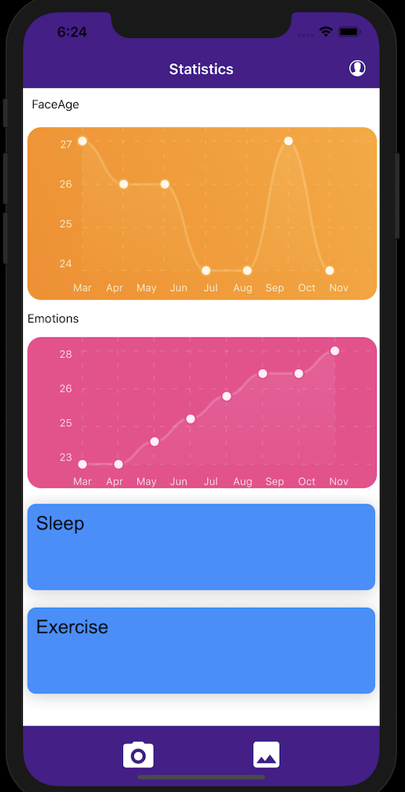

###Glace### 
Glace is iOS application that can detect underlying health conditions.  
###How it works###  
Glace uses a neural network to infer your emotional state and apparent age and finds a correlation to established health metrics. Give Glace a try!

###Tech Stack###  

###Demo###  

